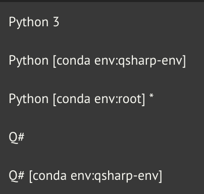
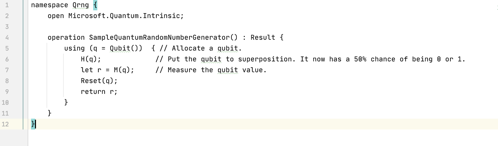
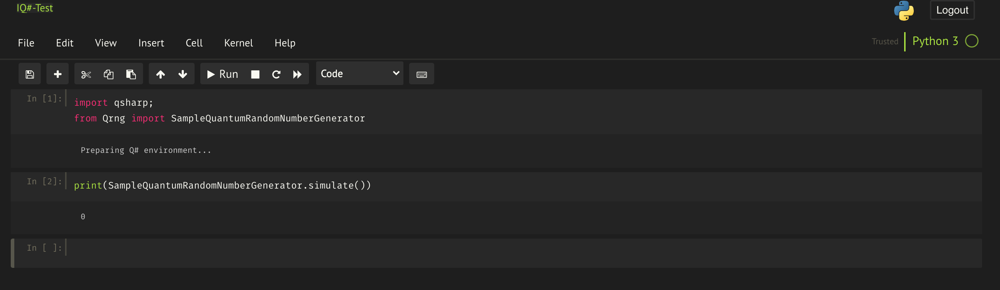
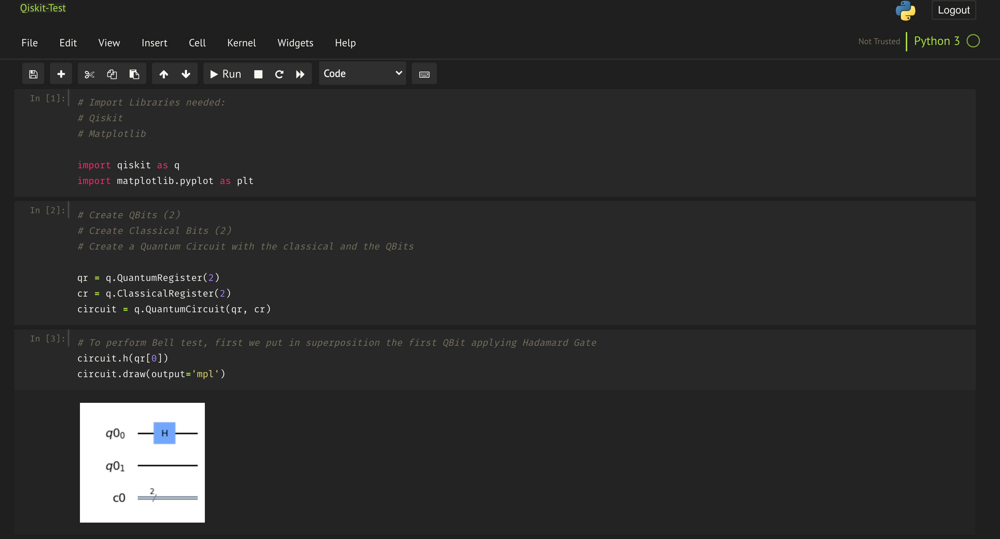
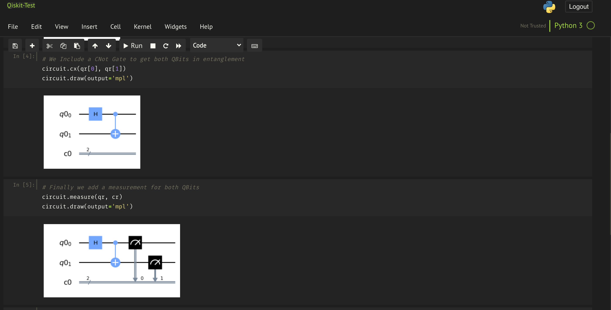
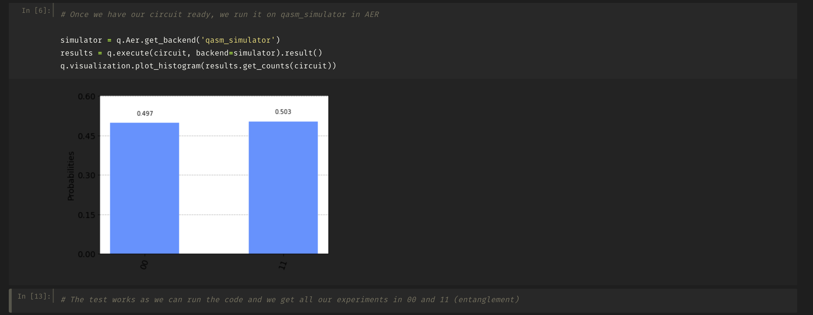

# Quantum Studio

Docker image with Jupyter Notebook and Quantum environments for development purposes.

## Contents
This image is based on Python 3.7.2 on Debian Linux (Conda Distribution).

Packages installed are:
* qiskit
* qsharp
* cirq
* tensorflow
* tensorflow-quantum

Jupyter Notebook includes themes available for dark mode and NBExtensions installed.

All the packages are available through a Jupyter Notebook in http://localhost:8080

Password is: 'quantum-studio-user'

## 1. Shared Folders

Jupyter Notebook root folder is mapped to the data folder provided within the same location of the image.

All notebooks created within the image will be available in the examples folder. All examples shipped with the image will 
be provided within this folder.
 
## 2. How to build the environment

Docker is a requirement to build and run the image.

To install Docker, follow instructions at: https://www.docker.com/ 

Once Docker is available in the computer, run the following script:

```
    ./build-docker.sh
```


## 3. How to start it. 

To start up the image, run the following script:

```
    ./start-docker.sh
```

To stop the image, run the following script:

```
    
```

## 4. Kernels included

The environment includes 3 environments, two Python and one for Q#:




### 4.1. Python 3

Within Python3, there are two options: 
* Python [conda env: root]. Main kernel, here are all the quantum packages needed to run the Quantum experiments in Python.
* Python [conda env: qsharp-env]. This kernel has the ability of running Q# code within Python.


### 4.2. Q#

For Q#, only kernel included is:
* Q# [conda env:qsharp-env]. Here will execute Q# code in Jupyter Notebook.


## 5. Examples included in the environment

### 5.1. Q# - Random Number Generator

A Jupyter notebook and a Q# file to perform a random number generator:
* Operation.qs: File with the Q# code to run random number generation.




* IQ#-Test.ipynb: Python Jupyter Notebook to execute Q#. 




### 5.2. Qiskit - Bell TEst

A Jupyter notebook to run Bell test using Qiskit.
* Qiskit-Test.ipynb






